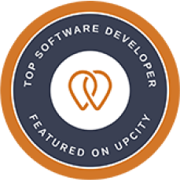
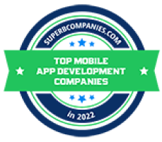

# Welcome to Code District 👋

## 🌟 About Us

Code District is a leading provider of custom web and mobile application development services.  
We focus on helping our clients achieve success and launch innovative solutions.  
Visit us at [codedistrict.com](https://codedistrict.com/).

## 🏆 Achievements on Clutch

We are proud to be recognized by **Clutch** and other platforms for our outstanding performance and dedication to delivering top-notch solutions:

- **Top Development Partner in the United States**  
  Recognized for excellence in web and mobile application development.

- **5-Star Client Reviews**  
  Praised by our clients for our commitment to quality and innovation.  
  Check out our reviews on [Clutch](https://clutch.co/profile/code-district).

### Clutch and Other Achievements

    
    
    
    
    
    
    
    
    
    

---

## 🚀 What We Do

- **Research:** Advancing technologies and exploring innovative solutions for real-world challenges in machine learning, cloud computing, and more.  
- **Development:** Delivering high-quality, scalable, and secure software applications tailored to client needs.  
- **Community Engagement:** Hosting events, sharing knowledge, and supporting the open-source community to foster collaboration and innovation.

---

## 🛠️ Key Repositories

| Repository Name | Description | Tech Stack |
|------------------|-------------|------------|
| [nextjs-template](https://github.com/Code-District-Team/nextjs-template) | A Next.js project template for quick setup. | TypeScript |
| [nestjs-template](https://github.com/Code-District-Team/nestjs-template) | A NestJS project template for scalable applications. | TypeScript |
| [react-vite-template](https://github.com/Code-District-Team/react-vite-template) | A React template powered by Vite for fast development. | JavaScript |

➡️ Explore all our repositories [here](https://github.com/orgs/Code-District-Team/repositories).

---

## 🌍 Join Our Community

- **LinkedIn**: [Code District](https://www.linkedin.com/company/code-district)
- **Facebook**: [Code District Facebook](https://www.facebook.com/codedistrictpk)
- **Instagram**: [Code District Instagram](https://www.instagram.com/codedistrictofficial?igsh=eXRzY25lemU4eDN4)
- **Twitter**: [Code District Twitter](https://x.com/code_district?s=21&t=QWuvOXMVfXHfev6tbevAkg)
- **YouTube**: [Code District YouTube](https://www.youtube.com/@codedistrictofficial)
- **Website**: [codedistrict.com](https://codedistrict.com/)

---

## 💡 Get Involved

We welcome contributions from the community!  
Whether you're fixing bugs, adding features, or improving documentation, your help is valued.

### 📑 Contribution Guide

1. Fork the repository.
2. Create a new branch (`feature/your-feature-name`).
3. Make your changes and commit.
4. Open a pull request.

Check out our full [contributing guidelines](/CONTRIBUTING.md) for more details.

---

### 📩 Contact Us

For inquiries, reach out to us at [info@codedistrict.com](mailto:info@codedistrict.com).  
Let’s build something amazing together! 🚀

---